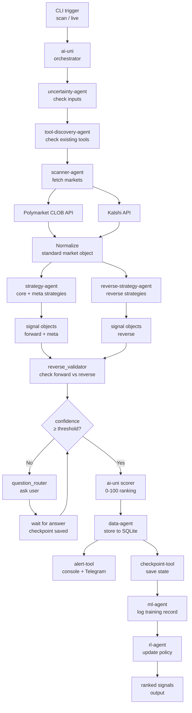

← [[HOME]] → [[architecture/overview]]

# Pipeline Flow

## Full Pipeline Diagram

## Stage Descriptions

| Stage | Agent/Tool | Output |
|---|---|---|
| Scan | [[agents/scanner-agent]] | Raw market data |
| Normalize | [[agents/scanner-agent]] | Standard market objects |
| Core Strategy | [[agents/strategy-agent]] | Forward signals |
| Reverse Strategy | [[agents/reverse-strategy-agent]] | Reverse signals |
| Meta Strategy | [[agents/strategy-agent]] | Meta signals |
| Uncertainty Check | [[agents/uncertainty-agent]] | Confidence score |
| AI Score | [[agents/ai-uni]] + [[modules/ai]] | Ranked signal list |
| Store | [[agents/data-agent]] | SQLite rows |
| Alert | [[tools/alert-tool]] | Console / Telegram |
| Checkpoint | [[tools/checkpoint-tool]] | Saved state |

## Related

[[pipeline/scheduler]] · [[architecture/checkpointing]] · [[architecture/uncertainty-model]]
