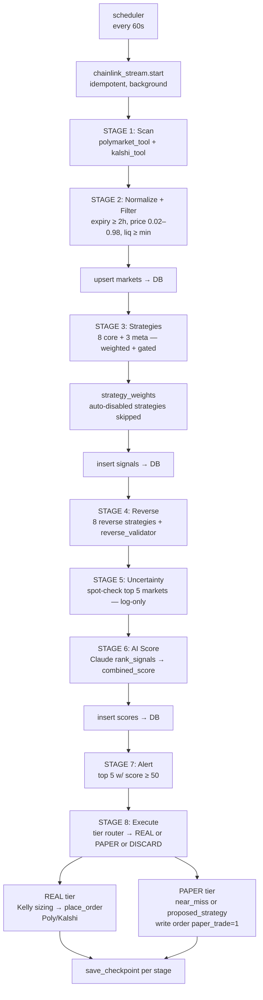

← [[HOME]] → [[architecture/overview]]

# Pipeline Flow

Source of truth: `core/engine.py::run_pipeline()` (called every 60s by `core/scheduler.py`). This doc mirrors the **actual code**, not aspiration.

## Online pipeline — one cycle (~60s)



## Stages (actual code order)

| # | Stage | Module | Output |
|---|---|---|---|
| 0 | Chainlink stream init | `tools/chainlink_stream.py` | WebSocket thread (idempotent) |
| 1 | Scan | `tools/polymarket_tool.py`, `tools/kalshi_tool.py` | Raw market dicts |
| 2 | Normalize + Filter | `engine._filter_markets` | Markets passing `EXPIRY_HOURS_MIN`, price, liquidity gates |
| 3 | Core + Meta Strategies | `tools/strategy_tool.run_strategies(core)` + `(meta)` | Forward signals (weighted by `strategy_weights`, disabled ones skipped) |
| 4 | Reverse + Validation | `strategy_tool.run_strategies(reverse)` + `reverse_validator.validate_all` | Reverse signals + validations that downgrade/discard forwards |
| 5 | Uncertainty | `core/uncertainty_engine.uncertainty_score` | Spot-checked on top 5 markets; logged only (does **not** block pipeline in live mode) |
| 6 | AI Score | `ai/scorer.rank_signals` | `combined_score` ∈ [0,100], `confidence` ∈ [0,1] |
| 7 | Alert | `tools/alert_tool.send_alert` | Console + Telegram for top 5 ≥ 50 |
| 8 | Execute (tier routing) | `engine` + `tools/execution_tool.place_order` | Real orders OR paper orders (see [[#Signal tier routing]]) |

Every stage calls `save_checkpoint()` with its name → stored in `checkpoints` table → resumable on restart.

## Signal tier routing (stage 8)

Every signal is classified:

| Tier | Rule | Action |
|---|---|---|
| **REAL** | `score ≥ MIN_SIGNAL_SCORE (75)` AND `conf ≥ MIN_CONFIDENCE_EXEC (0.70)` AND strategy **not** in `_PAPER_STRATEGIES` | Kelly-sized real order on the exchange |
| **PAPER (near-miss)** | `score ∈ [PAPER_MIN_SCORE (60), 75)` AND `conf ≥ PAPER_MIN_CONF (0.50)` | Written to `orders` with `paper_trade=1, status='paper'` — exchange never contacted |
| **PAPER (proposed-strategy)** | Strategy is in `tools/strategy_tool._PAPER_STRATEGIES` (`smart_money` today) | Same as near-miss |
| **DISCARD** | below both thresholds | No order, no row |

Paper orders are resolved by `outcome_tracker` identically to real orders, giving us counterfactual data to tune thresholds and validate unproven strategies.

## Offline loops (not part of run_pipeline, run as separate Windows)

| Loop | Module | Cadence | Purpose |
|---|---|---|---|
| Position monitor | `core/position_monitor.py` | 5 min | Stop-loss (−40%) / Take-profit (+80%) on open Poly positions |
| Outcome tracker | `core/outcome_tracker.py` | 30 min | Reads closed markets from CLOB API, writes `results`, triggers `strategy_weights.update_weights()` |
| Wallet registry refresh | `core/wallet_registry.py` | 6h (lazy, on smart_money detect) | Cross-references leaderboard across 4 windows (DAY/WEEK/MONTH/ALL) |

## Adaptive feedback (closed loop)

```
real + paper trades resolve
        ↓
results table (won/lost, pnl_usd)
        ↓
┌───────────────────────────────────────┐
│ strategy_scorecard.scorecard()        │ ← per-strategy win rate + PnL
│ strategy_weights.update_weights()     │ ← auto-disable <35% WR, boost >55%
│ threshold_tuner.suggest_thresholds()  │ ← advisory MIN_SIGNAL_SCORE
│ ml/reranker.py (scaffold, ≥100 rows)  │ ← XGBoost win-prob → Kelly edge scaler
│ ai/strategy_generator.py (≥500 rows)  │ ← Claude proposes new strategies
└───────────────────────────────────────┘
        ↓
next cycle: strategy_tool applies updated weights + skips disabled
```

## Stages in the obsidian diagram that are **not** part of the live loop

- `question_router` — code exists (`core/question_router.py`) but runs only in non-live / interactive mode. Live bot logs uncertainty events instead of blocking. This is intentional: a 24/7 bot can't stop for human input.
- `tool-discovery-agent`, `ai-uni` orchestration — these are Claude Code *skills* / *subagents* used during **development**. They are not called by the production loop.
- `ml-agent` / `rl-agent` as live per-cycle hooks — replaced by the offline `outcome_tracker` → `strategy_weights` feedback loop. ML re-ranker + RL policy are scaffolds, gated on outcome volume.

## Related
[[pipeline/scheduler]] · [[architecture/checkpointing]] · [[architecture/uncertainty-model]] · [[architecture/reverse-thinking]]
